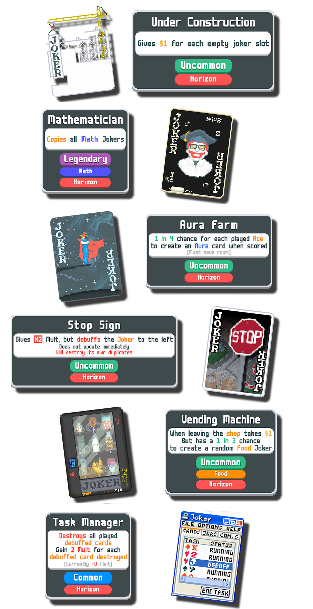

This is still in active development and is probably broken and may crash so be warned

This mod requires Lovely and Steamodded to function.

Link to Steamodded (Which includes instructions on how to install Lovely): https://github.com/Steamodded/smods/wiki

# Horizon

A shitty balatro mod made by a bunch of nerds

Currently adds (Hidden Cards not Included)

    104 Jokers [8 of which are Work in Progress and can be Disabled]
    -   27 [+2 WIP] Common
    -   35 [+1 WIP] Uncommon
    -   16 [+4 WIP] Rare
    -   8 [+1 WIP] Legendary
    -   10 Modded Rarity
    
    9 Enhancements
    
    26 Consumables
    
    -   3 [+1 WIP] Tarots
    -   4 Spectrals
    -   Rest are custom [9 are Work in Progress]
    
    2 Seals
    
    6 Booster packs
    
    6 Decks
    
    3 Tags
    
    8 Blinds

    1 [+1 WIP] Vouchers

There are currently no unlock requirements implemented

Is it balanced? Probably poorly.

Is it fun? We say so.

How do I download it?

Go to [Releases](https://github.com/FunctionalNyx/Horizon/releases) for a stable experience.
Otherwise just download the code directly on the [GitHub](https://github.com/FunctionalNyx/Horizon) for the most "up-to-date" version thats probably broken (Proceed at your own risk)

Have fun

## About the Nerds

### Coders
    Nyx - Main Coder
    bozo! - Occasionally Helps (Also does art)

### Artists
    Milk Mann
    Astololofo
    Moist
    Dread